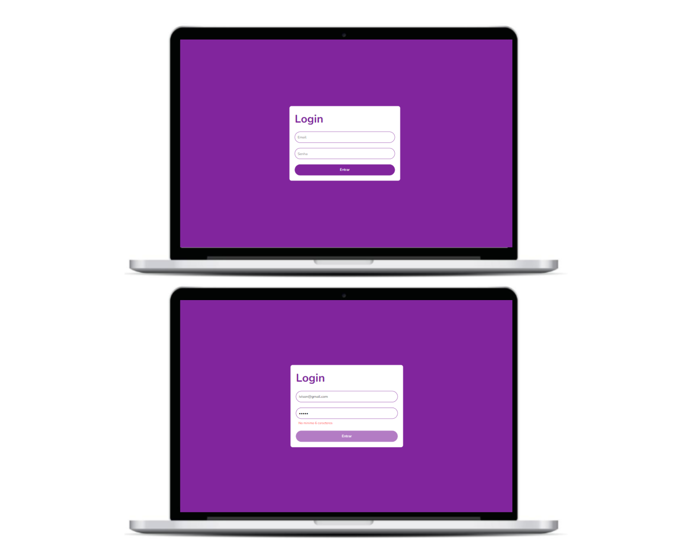

# Tela de Login

## Descrição

Este projeto é uma tela de login construída com TypeScript e React que faz validação de email e senha. Caso o email não tenha a estrutura de um email e a senha não atinja a quantidade mínima de 6 caracteres, é emitido uma mensagem de erro.

## Tecnologias Utilizadas

- TypeScript
- React

## Como Executar

1. Clone o repositório para o seu computador.
2. Instale as dependências com npm install.
3. Inicie o projeto com npm start.

## Funcionalidades

- Validação de email e senha.
- Mensagem de erro caso o email ou a senha não atendam aos requisitos.

## Contribuindo

Se você deseja contribuir com este projeto, por favor, faça um fork do repositório e envie um pull request com suas alterações.
